Projet Système Réparti — Déploiement Web avec Docker, Kubernetes, Ansible et Jenkins
1. Introduction

Objectif pédagogique : déployer une application web répartie avec microservices, conteneurisation et pipeline CI/CD

Contexte : startup avec frontend, backend et base PostgreSQL

Technologies : Flask, PostgreSQL, Nginx, Docker, Kubernetes, Ansible, Jenkins

2. Architecture cible

Schéma architecture microservices :

Frontend (Nginx)
       |
       v
   Backend API (Flask)
       |
       v
  PostgreSQL Database

Capture à insérer : schéma graphique de l’architecture

3. Développement et Conteneurisation

Frontend : Angular/React simple servie par Nginx

Backend : Flask API avec modèles User et Product

Dockerfiles et docker-compose.yml pour tests locaux

Captures / logs :
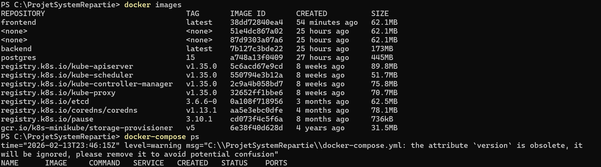
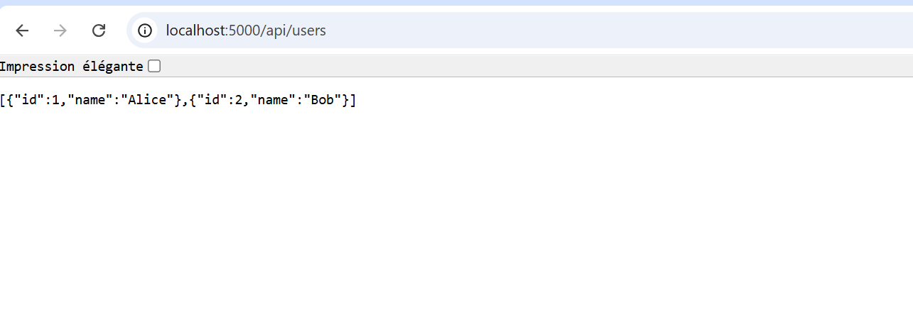
curl http://localhost:5000/api/users

4. Déploiement Kubernetes (Minikube)

Secrets, PVC, Deployments, Services, Ingress

Commandes :

kubectl apply -f infra/
kubectl get nodes
kubectl get pods
kubectl get svc
minikube service frontend-service

Captures : 
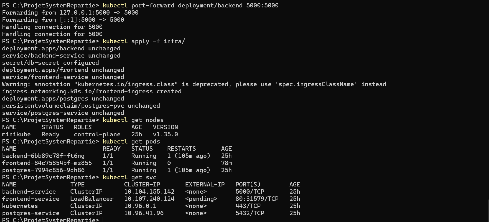
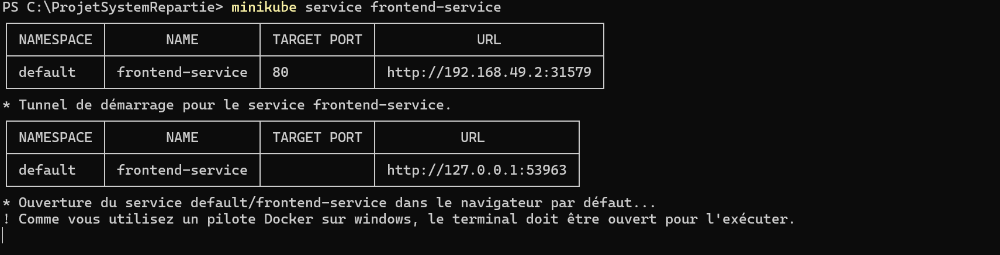

Page frontend accessible via Minikube URL
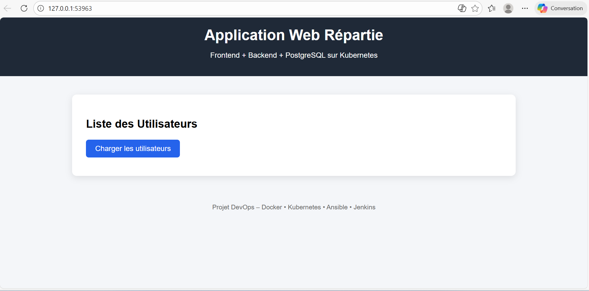

5. Résolution problèmes / Notes techniques

Nginx error: host not found in upstream "backend" → corrigé dans default.conf

Vérification frontend pods : Running

Capture :
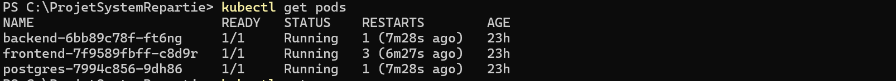

kubectl logs frontend-xxx montrant frontend opérationnel

6. Ansible Playbook

Sections : Docker, kubectl, Minikube, build Docker, déploiement K8s, vérification

Variables : kubectl_version, minikube_version

Commande :

ansible-playbook -i inventory.ini playbook.yml

7. CI/CD Jenkins

Pipeline : lint, test, build Docker, push, deploy K8s

Jenkinsfile : orchestré avec les manifests K8s

Captures :
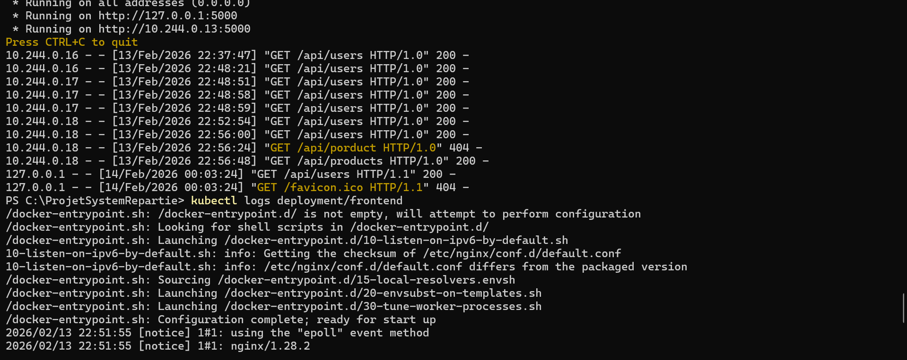
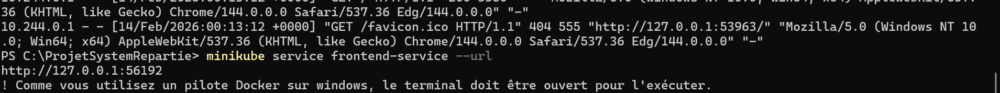

Interface Jenkins avec pipeline vert / étapes exécutées

8. Tests finaux

Frontend : page web accessible avec données

Backend : /api/users retourne JSON

PostgreSQL : accessible via service

Captures  :

Page frontend finale
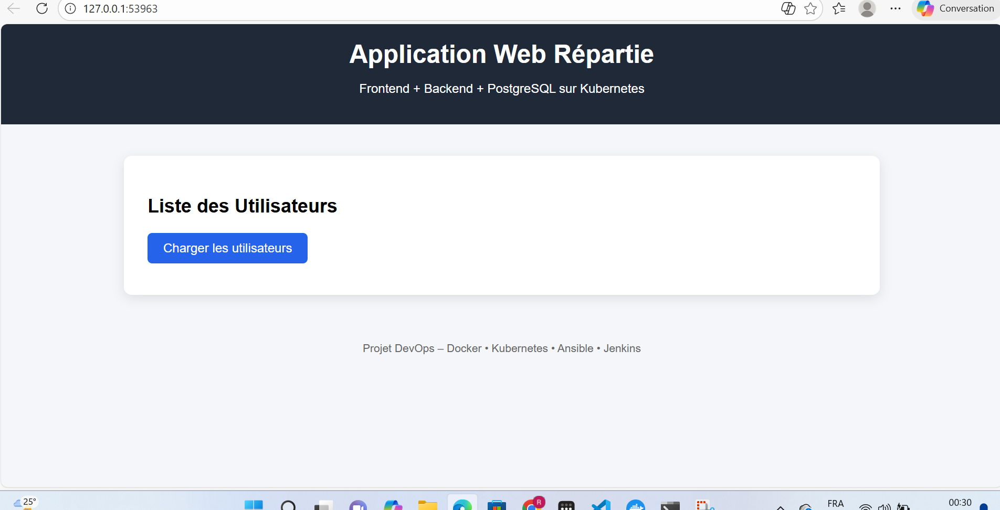

kubectl get pods final
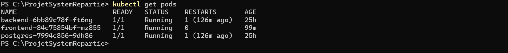

kubectl get svc final
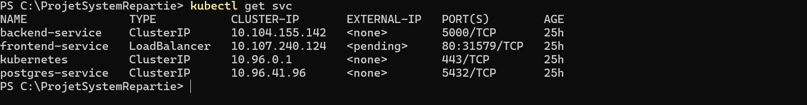

JSON de l’API
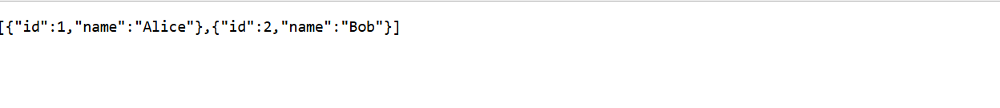

9. Conclusion

Projet complet microservices conteneurisés avec déploiement automatisé

Points forts : automatisation Ansible, Kubernetes, CI/CD

Prochaines étapes : réplication PostgreSQL, production-ready secrets

10. Annexes

Logs backend / frontend / PostgreSQL

Commandes utilisées : kubectl, docker-compose, ansible-playbook